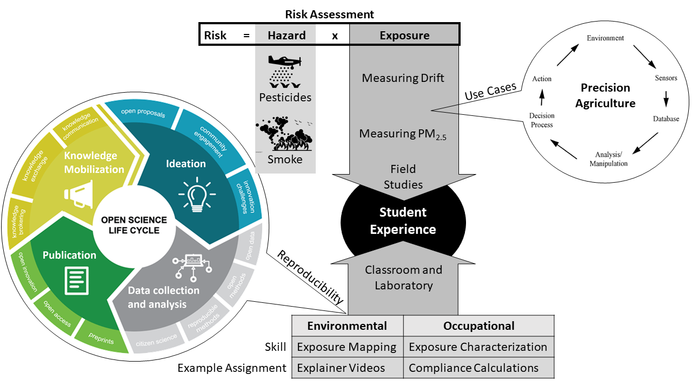
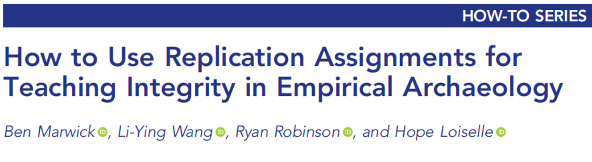
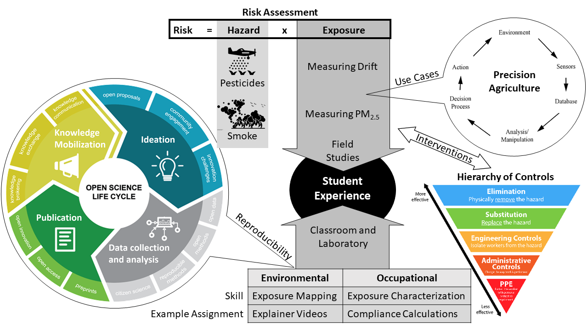

```{r xaringan-themer, include=FALSE, warning=FALSE}

options(htmltools.dir.version = FALSE)

library(xaringanthemer)
style_mono_accent(
  base_color = "#23395b",
  header_font_google = google_font("Oswald"),
  text_font_google   = google_font("Oswald", "300", "300i"),
  code_font_google   = google_font("Fira Mono"),
  text_font_size = "1.5rem",
  link_color = "#A38A00"
)

```

## Today's expectations

- **Time:** 40 minutes

- **Audience:** DEOHS students, staff, and faculty

- **Goal:** Demonstrate teaching approach to undergraduate students

- **Activities**
    - *Individual:* **live polling**; **zoom chat 'waterfall'**; quick-writes
    - *Group:* norms; random call; think-pair-share; discussion guides

???

Thanks for being here today. I go by he/him pronouns. My living space sits on Coast Salish land. I would like to acknowledge the contributions and lives and knowledge of native, Black, and all people of color. We are indebted to their sacrifices and those of all workers on the front lines whose labor and participation in research has contributed to improvements in population health.
  
---
class: inverse

## Objectives

1. *Differentiate risk perception and risk assessment*

2. Examine use cases for precision agriculture in exposure science

3. Define reproducibility in environmental and occupational health sciences

---
## Terms

- **Risk assessment:** probability of adverse health effects from human *exposure* to a *hazardous agent*

- **Use case:** interactions between an actor and a system to achieve a goal

- **Precision agriculture:** farm management strategy that uses information technology to improve commodity quality and production

- **Reproducible research:** documentation of methods used to obtain data and making code to calculate results easily accessible

???

- Key ingredients for today
- Interplay between hazard and exposure
- Rooted in computing, but offers a great way for us to problem solve and use the hierarchy of controls to develop interventions
- Precision agriculture is an exciting areas I've engaged with that generates a lot of data for decision support
- Reproducible research is a exciting area that contributed to the pandemic response

---
class: center

#### Use Cases for Precision Agriculture in Exposure Science

```{r talk-map-1, echo=FALSE, out.width = '150%', fig.align="center"}

```

???
- Mapped out today's talk for you with these ingredients
- The flow centers around the student experience through field studies and classroom and laboratory science
- Risk assessment, which can be defined as risk = hazard x exposure, 

---
class: center

#### Use Cases for Precision Agriculture in Exposure Science

```{r talk-map-2, echo=FALSE, out.width = '150%', fig.align="center"}

```

.footnote[
<tiny><small>Source: Government of Canada, 2022. What is open science?</small></tiny>
]

---
class: center

### [Lead galena](https://www.sciencedirect.com/topics/earth-and-planetary-sciences/galena): Is this miner's health at risk?

```{r miner, echo=FALSE, out.width = '70%', fig.align="center"}

```

???

Wikipedia: Galena, also called lead glance, is the natural mineral form of lead(II) sulfide. It is the most important ore of lead and an important source of silver.

--

### When would lead be a *risk* instead of a *hazard* ?

.footnote[
<tiny><small>Source: Getty Images. </small></tiny>
]

???

1. Natural mineral form of lead(II) sulfide
2. Important ore of lead and source of silver
3. Not harmful to touch or handle

---
### What's the difference between a hazard and a risk?

- Exposure or action is needed to transform a hazard into a risk

- Hazard is the potential to cause harm, while risk is the
likelihood of harm in defined circumstances

- Hazard is the possibility of something causing harm, while risk
is the probability of something causing harm

---
class: center

### [Poll](https://www.polleverywhere.com/multiple_choice_polls/aqvtTUFajoi86SV55okfe): Which items are highest risk? Please pick your top 5.

```{r risk-perception-list, echo=FALSE, out.width='100%', fig.align="center"}
knitr::include_graphics("images/risk-perception-list.png")
```

.footnote[
<tiny><small>Source: All icons from The Noun Project, 2022. </small></tiny>
]

???

---
```{r perceived-risk-lowv, echo=FALSE, out.width = '50%', fig.align="center"}

```

.footnote[
<tiny><small>Source: Fishhoff et al., 1978. </small></tiny>
]

???
In fact, this poll was first administered in 1978.

---
class: middle

.pull-left[
**Perceived as less risky**
- Voluntary
- Controlled by oneself
- Clear benefits
- Distributed fairly
- Natural
- Trusted source
- Familiar
- Affect adults
- **Low dread**
- **Known**
]

--

.pull-right[
**Perceived as more risky**
- Involuntary
- Controlled by others
- Unclear benefits
- Distributed unfairly
- Human-made
- Untrusted source
- Unfamiliar
- Affect children
- **High dread**
- **Unknown**
]

---

```{r risk-perception-matrix-1, echo=FALSE, out.width = '75%', fig.align="center"}
knitr::include_graphics("images/dread-unknown-risk.png")
```

.footnote[
<tiny><small>Source: Fox-Glassman and Weber, 2016. What makes risk acceptable? ... </small></tiny>
]

???
In fact, this poll was first administered back in 1978.

---
```{r perceived-risk-benefit, echo=FALSE, out.width = '60%', fig.align="center"}
knitr::include_graphics("images/perceived-risk-benefit.png")
```

.footnote[
<tiny><small>Source: Fox-Glassman and Weber, 2016. What makes risk acceptable? ... </small></tiny>
]

???
Shows most response have been the same.

---
### Risk assessment vs. Risk perception

- Risk assessment
  - Hazard $\neq$ Risk
  - Risk occurs when there is *exposure* to the hazard
  - **Risk $=$ Hazard $\times$ Exposure**
  
- Risk perception
  - Includes the lived experience of communities
  - Involves psychosocial factors
  - People consider different things hazardous or risky
  - **Risk $=$ Hazard $+$ Outrage**

---

## Occupational carcinogens

- Risk = Hazard $\times$ Exposure 
- **Workers have had a major role in identifying human carcinogens**
- Among 120 IARC Group 1 carcinogens:
    - 40% were identified in occupational studies
    - 60+% with documented occupational exposures
- Progress, but
    - more than 80,000 chemicals used in industry
    - most agents have never been evaluated, so no human evidence

---

## Canaries in the coal mine

```{r canary-coal-mine, echo=FALSE, out.width = '95%', fig.align="center"}

```

.footnote[
<tiny><small>Source: Getty Images. </small></tiny>
]

---

## Occupational carcinogens

- Risk = Hazard $\times$ Exposure 
- Workers have had a major role in identifying human carcinogens
- Among 120 IARC Group 1 carcinogens:
    - 40% were identified in occupational studies
    - 60+% have documented occupational exposures
- Progress, but
    - more than 80,000 chemicals used in industry
    - most agents have never been evaluated, so human evidence

---
## Risk assessment and scientific uncertainty 

```{r science-divided, echo=FALSE, out.width = '75%', fig.align="center"}

```

.footnote[
<tiny><small>Source: The New Yorker, 1988. </small></tiny>
]

???
While we can rate things for an exercise like this, it's different to live in a place where hazards are seen as more risky.

---
### Science and uncertainty

- Scientific work is incomplete
- Scientific work is liable to modification by advancing knowledge 
- That does not confer freedom to ignore current knowledge
- Or postpone action that it appears to demand at a given time

### Conditions for acceptable risk

- Level of risk must be below a threshold
- Benefits must clearly outweigh risks
- Distributional justice: health of a subgroup cannot be sacrificed

---

## Precautionary principle

**Wingspread Statement:** 

>*“When an activity raises threats to the environment or human health, precautionary measures should be taken, even if some cause-and-effect relationships are not fully established scientifically”*

.footnote[
<tiny><small>Source: Raffensperger and Tickner, 1999. </small></tiny>
]

???
While we can rate things for an exercise like this, it's different to live in a place where hazards are seen as more risky.

---
class: center

### [Poll](https://www.polleverywhere.com/clickable_images/KOdpa10xXfvbxeTBR4f4R): Plot climate change on the risk perception matrix.

```{r climate-change, echo=FALSE, out.width = '70%', fig.align="center"}
knitr::include_graphics("images/polar-vortex-2019.gif")
```

.footnote[
<tiny><small>Source: NASA, 2019. </small></tiny>
]

???

- Pesticides on the poll
- Wildfire smoke is one of many climate change impacts

---
class: inverse

## Objectives

1. Differentiate risk perception and risk assessment

2. *Examine use cases for precision agriculture in exposure science*

3. Define reproducibility in environmental and occupational health sciences

---

## What is exposure science?

- Study of contact (e.g. **swallowing, breathing, or touching**) over time and space with environmental factors and their effects on the human body (**"place and time makes the poison"**)

--

- Scientists seek to understand how various agents are transported across **air, water, and land** and transformed in the human body

--

- It is problem-based:
    - Defines sources, pathways, and routes of exposure
    - Requires measurement, interpretation, and judgment
    - Suggests interventions to be evaluated

---

## Industrial Hygiene

- **Anticipation:** proactively estimate potential health and safety concerns that are commonly, or at least potentially, associated with a given occupational or environmental setting
- **Recognition:** identify potential and actual hazards in a workplace through direct inspection
- **Evaluation:** measure exposures through visual or instrumental monitoring of a site
- **Control:** reduce the risk to health and safety through administrative engineering measures

---
### Mathematical definition of exposure

$$E = \int_{t1}^{t2} C(t) dt$$

$E$ = exposure is the integral of a concentration that varies with time between the beginning and end of exposure ( $\frac{mass \times time}{volume}$ )

$C$ = concentration of a substance ( $\frac{mass}{volume}$ ) at any given time $t$

$t_1$ and $t_2$ = beginning and end of exposure, respectively ( $t$ )

.footnote[
<tiny><small>Source: Fenske, 2016. </small></tiny>
]

---

### Thought experiment: definition of exposure, example 1

$$E = \int_{t1}^{t2} C(t) dt$$

- From 8:30 to 9:50 AM, you are in a room with a constant air concentration of 10 $\mu$g/m<sup>3</sup> of Chemical A. 

- **What is your exposure?**

.footnote[
<tiny><small>Source: Fenske, 2016. </small></tiny>
]

---

### Thought experiment: definition of exposure, example 2

$$E = \int_{t1}^{t2} C(t) dt$$

- In the room next door, the air concentration of a highly toxic chemical is 50 $\mu$g/m<sup>3</sup>.

- You need to walk through that room to get outdoors. It will take you 10 seconds to walk through the room.

- **What is your exposure?**

.footnote[
<tiny><small>Source: Fenske, 2016. </small></tiny>
]

---
class: inverse, center, middle

# Use Case #1: Pesticides Exposure

---

### Precision agriculture 25 years ago

```{r precision-ag, echo=FALSE, out.width = '70%', fig.align="center"}

```

.footnote[
<tiny><small>Source: National Academies of Science, 1997. </small></tiny>
]

???

This is a conceptual diagram of a decision support system from a 1997 NAS report. Tracing the steps in the figure, information can be viewed as flowing from environment via human or instrumented sensors to a database. The data is analyzed and manipulated for storage and transmission to a user as part of a decision process, which results in an action to be executed within the environment. And the cycle continues. 
 
I think I heard this from Cap that about 10% of farms produce roughly 90% of food and are highly engaged in technology. 90% of farms produce less food and might have less technology. The pandemic has increased bandwidth and the next generation of farmers will be very connected. 

Looking ahead with cautious optimism, it may finally be data’s time to shine, but it won’t be without challenges of course. 

---

### Agriculture 4.0

```{r evolution-ag, echo=FALSE, out.width = '100%', fig.align="center"}
knitr::include_graphics("images/industry-ag-evolution.png")
```

.footnote[
<tiny><small>Source: Mazzetto et al., 2020. </small></tiny>
]

???

This offers a comparison between the evolutionary technological phases of agriculture and general industry. Agriculture 0.0 involved prevalent use of manual labor and animal traction up until 1920 or so. Then, Agriculture 1.0 began with the introduction of diesel engines alongside prevalent manual labor through 1960. Agriculture 2.0 might be defined as the time between 1960 and 1980 when many manual labor tasks were replaced by machines in farm production areas and resulted in increased yields due to genetic and chemical innovations. Agriculture 3.0 from 1980 to 2000 was defined by the introduction of more electronic control systems on board tractors and the first attempts to digitalize farm management.  After 2000, Agriculture 4.0 or “Smart Agriculture” might be defined as the diffusion of tractor position systems, communication protocols, and integrated farm information systems (wireless networks, Bluetooth, cloud computing, artificial intelligence).

---

### Digital Divide?

```{r networked-farm, echo=FALSE, out.width = '100%', fig.align="center"}

```

.footnote[
<tiny><small>Source: DeAngelis, 2014. </small></tiny>
]


???

Historically, measurement of environmental contaminants has posed significant challenges to characterizing human health risks, especially in rural areas. Modern decision support systems are powered by models that analyze vast amounts of data compiled from geospatial, optical, electro-chemical, mechanical, meteorological, and remote sensing technologies. The proliferation of sensor networks has enabled growers to optimize planting decisions, track crop health, and guide agrochemical use.  What tools are we looking at to improve safety and health? My interest is: how do you inject environmental and occupational safety and health into this picture?

---
class: center, middle

<iframe width="560" height="315" src="https://www.youtube.com/embed/QvFoRk4JsPc?start=123" title="YouTube video player" frameborder="0" allow="accelerometer; autoplay=1&mute=1; clipboard-write; encrypted-media; gyroscope; picture-in-picture" allowfullscreen></iframe>

<iframe width="560" height="315" src="https://www.youtube.com/embed/Kle7lhBNtF8?start=51" title="YouTube video player" frameborder="0" allow="accelerometer; autoplay=1&mute=1; clipboard-write; encrypted-media; gyroscope; picture-in-picture" allowfullscreen></iframe>

---

class: inverse, center, middle

# Use Case #1: Pesticide Exposure

---
class: center, middle

<iframe width="760" height="515" src="https://www.youtube.com/embed/wwAmAj-OrDI?start=20" title="YouTube video player" frameborder="0" allow="accelerometer; autoplay=1&mute=1; clipboard-write; encrypted-media; gyroscope; picture-in-picture" allowfullscreen></iframe>

---

## Interventions: pesticide drift exposure

- **Engineering controls**
  - Sprayer type and components
  
- **Administrative controls**
  - Drift sensor alerts
  - Wind sensor alerts

---

## Student research: pesticides

```{r mentorship-pesticides, echo=FALSE, out.width = '100%', fig.align="center"}

```

---

### Magali's results

```{r magali-sprayer-comparison, echo=FALSE, out.width = '100%', fig.align="center"}

```

.footnote[
<tiny><small>Source: Blanco, 2019. Real-Time Monitoring of Drift from Three Different Orchard Sprayers.</small></tiny>
]

???

Predictions of the 75th percentile PMC below the canopy for various distances and wind speeds outside of a spray field. Predictions were made from our restricted model (Table 4) using the US EPA's recommended spraying wind speeds of 3–10 MPH (1.3–4.5 m/s). The horizontal line represents the 75th percentile background concentration that was measured below the canopy during this study (13 μg/m3). The y-axis on the right shows the predicted PMC values rescaled relative to the background level. An individual would have to be located a minimum of about 500–600 ft (152–183 m), 340–500 ft (104–152 m) and 340–450 ft (104–137 m) downwind of an AFA, DAT and MFT sprayer application, respectively, before their exposure level was comparable to the background level. At 100 ft (30 m) downwind, their predicted PMC exposure level would be between 230 and 510 μg/m232, 110–230 μg/m3 and 70–160 μg/m3 during an AFA, DAT and MFT sprayer application, respectively. Higher PMC levels for any particular distance are associated with lower wind speeds (less dispersion).

---
class: inverse, center, middle

# Use Case #2: Wildfire Smoke Exposure

---

```{r smoke-event, echo=FALSE, out.width = '87%', fig.align="center"}

```

.footnote[
<tiny><small>
<blockquote class="twitter-tweet"><p lang="en" dir="ltr">A truly stunning perspective, w/massive wind-driven fires &amp; large dust storm in Washington/Oregon, &amp; vast extent of wildfire smoke extending continuously from California to Kansas. Wow. </p>&mdash; Daniel Swain (@Weather_West) <a href="https://twitter.com/Weather_West/status/1303128250369990656?ref_src=twsrc%5Etfw">September 8, 2020</a></blockquote>
</small></tiny>
]

???
Exceptional drought conditions last summer was not welcome news, especially after last summer. This satellite imagery shows massive wind-driven fires, large dust storms, and wildfire smoke extending across the West on September 7 and 8, 2020.

Tree fruit, wine grapes, hops, and other labor-intensive commodities are cornerstones of the Pacific Northwest agricultural economy. Smoke from recent fires has blanketed agriculturally intensive areas resulting in air quality deemed unhealthy. Increased wildfire activity has occurred during harvest from these crops making tens of thousands of workers and their employers more susceptible to the adverse health effects of smoke based on proximity to fire, larger amounts of time spent outdoors, and some of the higher levels of physical exertion.

---
class: middle

#### Air quality monitoring in rural areas 

```{r smoke-event-sensors, echo=FALSE, out.width = '100%', fig.align="center"}

```

???

We know that air quality monitors cover urban areas much better than rural areas. In Washington, we found that East of the Cascades, only 35 regulatory PM2.5 monitoring sites covered a land area of about 45,000mi2. This amounts to an area of about 1,286 mi2 per monitor or distances that could reach beyond 36 mi, on average. Additionally, there were limited or no air quality monitors in certain rural counties, some with high agricultural production.
One motivation of our recent research is to see if more local air monitoring in rural areas is useful to growers as a decision-support tool for worker, livestock, and crop health. Smoke taint is a growing issue among major fruit and beverage crops.
Some employers voluntarily use AQI classifications to inform decisions about outdoor work and a few states in the west are now requiring it.

---

class: middle, center

```{r awn, echo=FALSE, out.width = '100%', fig.align="center"}
knitr::include_graphics("images/awn.png")
```

---

class: middle

#### Rulemaking: outdoor worker exposure to wildfire smoke (AQI)

```{r smoke-rules, echo=FALSE, out.width = '85%', fig.align="left"}

```

---

## Interventions: wildfire smoke exposure

- **Administrative controls**
  - Smoke sensor alerts

- **Personal protective equipment**
  - Respirators and masks

---

## Student research: smoke

```{r mentorship-smoke, echo=FALSE, out.width = '100%', fig.align="center"}

```

---

## Claire's results

```{r claires-results, echo=FALSE, out.width = '100%', fig.align="center"}

```

.footnote[
<tiny><small>Source: Schollaert, 2022. In preparation. </small></tiny>
]

---

class: inverse

## Objectives

1. Differentiate risk perception and risk assessment

2. Examine use cases for precision agriculture in exposure science

3. *Define reproducibility in environmental and occupational health sciences*

---

### Reproducible Research

- **Reproducibility:** ability to obtain results by using the same data, code, and procedures

- **Replicability:** ability to arrive at the same scientific conclusions in a new study with new data, possibly different methods, and new analyses

- National Academies of Sciences, Engineering, and Medicine (2019):
    - Summary: [10 Things to Know About Reproducibility and Replicability](https://www.nap.edu/resource/25303/Ten%20Things%20to%20Know%20about%20Reproducibility%20and%20Replicability.pdf)
    
    - Full report: [Reproducibility and Replicability in Science](https://www.nationalacademies.org/our-work/reproducibility-and-replicability-in-science)
    
???

- Two scientists from audience for reproducibility and replicability
- General process has been supercharged by computing and coding
- Transparency, openness.
- Lots of energy around this right now, with good reason to advance since more quickly. 
- Change paradigm to share data and code with a willingness to be critiqued publicly 

--- 

#### Replication Assignment: UW Archaeology Undergraduates, 2019

```{r replication-1, echo=FALSE, out.width = '90%', fig.align="left"}

```

1. Selected a Study to Replicate (small groups)
2. Identified the Key Claims and Data in the Study
3. Began the Replication and Got Instructor Feedback
4. Completed Replication and Submitted Report, Code, and Data

---

#### Replication Assignment: UW Archaeology Undergraduates, 2019

```{r replication-2, echo=FALSE, out.width = '150%', fig.align="left"}

```

---
class: center, middle

### Use Cases for Precision Agriculture in Exposure Science

```{r talk-map-3, echo=FALSE, out.width = '150%', fig.align="center"}

```

---

## Bloom's taxonomy

```{r blooms, echo=FALSE, out.width = '150%', fig.align="center"}
knitr::include_graphics("images/blooms-sph381.png")
```

---

## Who gets to ask the research questions?

- Empower people on the ground
    - Close coverage gaps
    - Citizen science and "right to repair"
    - Digital inclusion agenda
- Data visualization
    - Engagement and decision support
- “FAIR(ER)” data principles
    - Findable, Accessible, Interoperable, Reusable
    - Ethical, Reproducible
    - Incentivize data and code sharing

---
## Self-check. Can I...

  - differentiate risk perception and risk assessment?
  
  - explain the difference between a hazard and a risk?
  
  - give two examples of exposure science in precision agriculture?
  
  - describe reproducibility?

---

class: center, middle

<iframe src="https://giphy.com/embed/jNYUeDwoUoloEswJm8" width="480" height="480" frameBorder="0" class="giphy-embed" allowFullScreen></iframe><p><a href="https://giphy.com/gifs/question-quiz-mark-jNYUeDwoUoloEswJm8"></a></p>

---
### Acknowledgements: NIOSH, UW, DEOHS, PNASH, WSU

Richard Fenske, Michael Yost, June Spector, Elena Austin, Edmund Seto, Chris Zuidema, John Flunker, Kit Galvin, Marcy Harrington, Pablo Palmández, Maria Tchong-French, Maria Negrete, Mary Jo Ybarra-Vega, Elizabeth Torres, Tomas Madrigal, Jane Pouzou,  Ryan Babadi, Magali Blanco, Christine Perez Delgado, Marissa Baker, Nancy Simcox, Jose Carmona, Dennise Drury, Idanis Cruz, Sarah Fish, Maria Blancas, Yoni Rodriguez, Aarti Tandon, Tania Busch Isaksen, Claire Schollaert, Gwen Hoheisel, Lav Khot, Lianne Sheppard, Chris Simpson, Marty Cohen, Noah Seixas, Sarah Benki-Nugent, Brian High, Elliot Norwood, John Yocum, Geoffrey Calvert...et al.

---
class: center, middle

<iframe src="https://giphy.com/embed/jNYUeDwoUoloEswJm8" width="480" height="480" frameBorder="0" class="giphy-embed" allowFullScreen></iframe><p><a href="https://giphy.com/gifs/question-quiz-mark-jNYUeDwoUoloEswJm8"></a></p>
